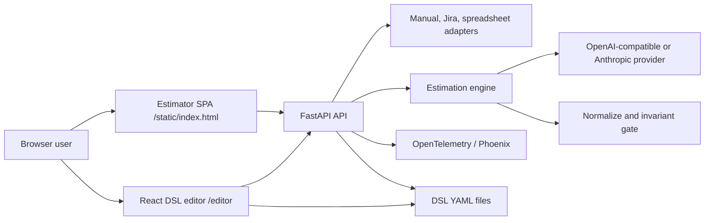

# Story Pointer — Complete Application Reconstruction and Production Specification

## 1. Purpose, authority, and reading rules

This document is the self-contained engineering contract for rebuilding the Story Pointer repository. A team starting from an empty directory should be able to reproduce the product behavior, API, estimator UI, visual DSL editor, observability, tests, and deployment model described here without needing unstated product knowledge.

The filename is intentionally `reacreate.md`, matching the requested name.

The words **MUST**, **SHOULD**, and **MAY** are normative:

- **MUST** is required for functional compatibility or production safety.
- **SHOULD** is the preferred implementation unless a documented reason prevents it.
- **MAY** is optional.

Every section distinguishes two states:

- **Compatibility baseline** describes what the audited repository currently does. Recreate it to preserve behavior.
- **Production target** describes the fixes and controls required before calling the rebuild production-ready. Production requirements override unsafe or defective compatibility behavior.

Do not interpret this specification as a request to copy current defects. In particular, the current runtime does not invoke the graph DSL during estimation, the editor has no graph execution command, and several administrative endpoints lack authorization. Those facts are recorded for accuracy and followed by explicit production requirements.

## 2. Product definition

Story Pointer is an evidence-led agile story-point estimator aimed at React/Spring banking teams. Users can enter one story manually, load an issue from Jira, or upload a CSV/XLS/XLSX workbook. The backend asks a configured LLM for a structured estimate, normalizes it, applies a non-negotiable safety gate, and streams progress and the final result to a browser. A separate React application edits graphon/Dify workflow YAML visually.

The product has four major surfaces:

1. A FastAPI service for estimation, ingestion, configuration, DSL files, and health.
2. A no-build estimator web application served from `static/index.html`.
3. A React/Vite visual DSL editor in `editor/`, served at `/editor` after building.
4. Two reference workflow artifacts, `dsl/graph_http.yml` and `dsl/graph_slim.yml`.

### 2.1 Non-negotiable estimation invariant

A point value MUST NEVER be returned or rendered unless all of these are true:

- `ok` is `true`;
- `points` is one of `1, 2, 3, 5, 8, 13`;
- `plain_language_why` is nonblank;
- `tldr` is nonblank.

This is enforced twice:

- The backend invariant gate redacts `points`, sets `ok=false`, and supplies an error when the result is not certifiable.
- Both browser renderers independently refuse to display an invalid point value even if a malformed server payload reaches them.

A 13-point result is also invalid unless it has at least two recommended sub-stories and every sub-story has a point value no greater than 8. A failing 13-point result is redacted rather than silently downgraded.

### 2.2 Estimation philosophy

- Story points are relative complexity, uncertainty, integration, validation, and delivery effort—not elapsed time.
- Person-days are a secondary planning range and must not replace points.
- Evidence from the supplied story must support factor ratings and the explanation.
- Missing information becomes an explicit assumption, risk, or spike recommendation.
- A story too large for one iteration must be split instead of legitimized as a normal 13.
- The browser should make “why” more prominent than the numeric score.

## 3. System architecture and execution flows



Compatibility baseline estimation is `request -> Python prompt builder -> direct provider HTTP -> Python normalization -> Python invariant gate -> SSE/JSON response`. `LLM_EXECUTION_MODE` exists in configuration and is exposed as metadata, but the `/estimate` routes do not execute either YAML graph. `run_graphon_slim()` is dormant. A faithful reconstruction must not falsely claim otherwise.

Production target must choose and document one of two coherent designs:

- **Python-authoritative:** remove the misleading execution-mode promise, keep Python as the only runtime, and treat YAML as editable/exportable workflow documentation; or
- **Graph-authoritative:** wire validated/versioned YAML execution into explicit run endpoints, preserve the same normalization and invariant gate after graph output, sandbox code nodes, and add parity tests against the Python route.

The recommended initial production release is Python-authoritative because it has the existing test coverage. Add graph execution as a separately secured capability.

## 4. Repository to recreate

```text
.
├── .env.example
├── .dockerignore
├── .gitignore
├── Dockerfile
├── banking_jira_stories.csv
├── banking_jira_stories_role_model.md
├── dify-sse-complete-architecture.md
├── pyproject.toml
├── requirements.txt
├── run.py
├── README.md
├── reacreate.md
├── recreate_all.md                 # legacy backend-focused specification
├── dsl/
│   ├── graph_http.yml
│   └── graph_slim.yml
├── story_pointer/
│   ├── __init__.py
│   ├── anchors.py
│   ├── api.py
│   ├── config.py
│   ├── dsl_api.py
│   ├── engine.py
│   ├── exports.py
│   ├── llm.py
│   ├── schema.py
│   ├── telemetry.py
│   └── sources/
│       ├── __init__.py
│       ├── jira.py
│       ├── manual.py
│       └── spreadsheet.py
├── static/
│   └── index.html
├── editor/
│   ├── index.html
│   ├── package.json
│   ├── package-lock.json
│   ├── vite.config.js
│   └── src/
│       ├── App.jsx
│       ├── Canvas.jsx
│       ├── CanvasNode.jsx
│       ├── Inspector.jsx
│       ├── Palette.jsx
│       ├── Toolbar.jsx
│       ├── api.js
│       ├── dslSerializer.js
│       ├── editorModel.test.js
│       ├── main.jsx
│       ├── nodeTypes.js
│       ├── store.js
│       └── styles.css
└── tests/
    ├── __init__.py
    ├── conftest.py
    ├── test_api_sse.py
    ├── test_engine.py
    ├── test_exports.py
    ├── test_invariant.py
    ├── test_production_safety.py
    ├── test_schema.py
    ├── test_sources.py
    └── test_telemetry.py
```

Generated and local-only directories (`.venv`, `.pytest_cache`, `.phoenix`, `editor/node_modules`, `editor/dist`, `*.egg-info`) MUST be ignored. Secrets in `.env` MUST never be committed.

## 5. Supported runtime and dependencies

### 5.1 Backend

- Python 3.11 or newer.
- FastAPI and Uvicorn for HTTP/ASGI.
- `sse-starlette` for `text/event-stream` responses.
- Pydantic v2 and `pydantic-settings` for contracts/configuration.
- `httpx` for provider and Jira requests.
- pandas, openpyxl, and xlrd for CSV/XLSX/XLS ingestion.
- PyYAML for DSL files.
- graphon plus its Slim integration for optional workflow validation/execution support.
- OpenTelemetry SDK/instrumentations and Arize Phoenix for traces.
- pytest, pytest-asyncio, and HTTPX test transport for tests.

The package name is `story-pointer`, current application version is `0.1.0`, and the import package is `story_pointer`. `pyproject.toml` is authoritative for package metadata and test configuration; `requirements.txt` is the installable dependency list and must not drift from it.

### 5.2 Editor

- Node.js 20 LTS or newer for the production build.
- React 18, React DOM 18.
- Vite 8.
- React Flow 11.
- Zustand 4.
- js-yaml 4.

The package lock file MUST be committed and CI MUST use `npm ci`. Production target adds Vitest, React Testing Library, user-event, jsdom, and Playwright.

## 6. Configuration contract

Configuration is read from environment variables and `.env` using a cached Pydantic settings object. Environment values take precedence. Secrets must be represented as secret types and must never appear in `/config`, logs, traces, or frontend markup.

| Variable | Default | Meaning |
|---|---:|---|
| `LLM_PROVIDER` | `openai` | `openai`, `groq`, `claude`, or `glm` |
| `LLM_EXECUTION_MODE` | `http` | Compatibility metadata: `http` or `slim`; currently does not reroute estimation |
| `OPENAI_MODEL` | `gpt-4o-mini` | OpenAI model |
| `GROQ_MODEL` | `llama-3.3-70b-versatile` | Groq model |
| `CLAUDE_MODEL` | `claude-3-5-sonnet-20241022` | Anthropic model |
| `GLM_MODEL` | `glm-4-flash` | GLM model |
| `LLM_TEMPERATURE` | `0.2` | Sampling temperature |
| `LLM_MAX_TOKENS` | `2400` | Provider output token cap |
| `LLM_RATE_LIMIT_WAIT_SECONDS` | `15` | Fallback wait after HTTP 429 |
| `LLM_RATE_LIMIT_MAX_RETRIES` | `3` | Maximum retry count |
| `OPENAI_API_KEY` | empty | OpenAI secret |
| `OPENAI_BASE_URL` | `https://api.openai.com/v1` | OpenAI-compatible base URL |
| `OPENAI_ORGANIZATION` | empty | Optional organization header |
| `GROQ_API_KEY` | empty | Groq secret |
| `GROQ_BASE_URL` | `https://api.groq.com/openai/v1` | Groq OpenAI-compatible base |
| `ANTHROPIC_API_KEY` | empty | Anthropic secret |
| `ANTHROPIC_BASE_URL` | `https://api.anthropic.com` | Anthropic base URL |
| `ANTHROPIC_API_VERSION` | `2023-06-01` | Anthropic version header |
| `GLM_API_KEY` | empty | GLM secret |
| `GLM_BASE_URL` | `https://open.bigmodel.cn/api/paas/v4` | GLM OpenAI-compatible base |
| `SLIM_MODE` | `local` | Slim launch mode |
| `SLIM_PLUGIN_FOLDER` | `.slim/plugins` | Local plugin directory |
| `SLIM_BINARY_PATH` | empty | Optional Slim binary override |
| `SLIM_DAEMON_ADDR` | empty | Remote daemon address |
| `SLIM_DAEMON_KEY` | empty | Remote daemon secret |
| `SLIM_MARKETPLACE_URL` | `https://marketplace.dify.ai` | Plugin marketplace |
| `JIRA_INSTANCES` | empty | JSON array of Jira connection objects |
| `ENVIRONMENT` | `development` | `development`, `test`, or `production`; production rejects unsafe defaults |
| `HOST` | `127.0.0.1` | Bind address |
| `PORT` | `8000` | Bind port |
| `CORS_ORIGINS` | `*` | Compatibility default; must be explicit in production |
| `MAX_UPLOAD_BYTES` | `10485760` | Maximum spreadsheet upload size |
| `MAX_BATCH_SIZE` | `100` | Maximum stories in one estimate batch |
| `MAX_DSL_BYTES` | `1048576` | Maximum DSL read/validate/save size |
| `DSL_WRITE_API_KEY` | empty | Required in production and sent as `X-DSL-API-Key` for DSL writes |
| `PHOENIX_ENABLED` | `true` | Enable tracing/export |
| `PHOENIX_COLLECTOR_ENDPOINT` | `http://127.0.0.1:6006/v1/traces` | OTLP HTTP endpoint |
| `PHOENIX_UI_URL` | `http://127.0.0.1:6006` | Link shown to users |
| `PHOENIX_PROJECT_NAME` | `story-pointer` | Trace project/service name |
| `PHOENIX_API_KEY` | empty | Optional collector authorization |
| `PHOENIX_BATCH` | `true` | Batch span export |
| `PHOENIX_CAPTURE_CONTENT` | `false` | Opt-in prompt/story/output capture |
| `PHOENIX_WORKING_DIR` | `.phoenix` | Local Phoenix storage |

`JIRA_INSTANCES` is a JSON array. Each object supports a stable `name`, `base_url`, deployment/type (`cloud` or `server`), authentication mode, email/username, token/password, and optional acceptance-criteria custom field. The configured instance name is the only browser-visible identity. Production must load secrets from a secret manager or injected environment and return only a redacted DTO such as `{name, deployment}`.

Startup validation MUST fail clearly when the selected provider lacks its API key, when enum values are unsupported, or when URLs are invalid. Production URL validation must allow only approved `https` destinations (with an explicit localhost development exception) and must define an SSRF policy.

## 7. Canonical wire models

### 7.1 Story input

```json
{
  "title": "DB-001: Biometric Login",
  "description": "Allow a customer to authenticate with device biometrics.",
  "acceptance_criteria": [
    "Given an enrolled device, when biometric validation succeeds, then sign in",
    "Fallback to the existing credential flow after biometric failure"
  ],
  "context": "React frontend; Spring API; security review required",
  "source": "manual"
}
```

Rules:

- `title` is required and has minimum length 1.
- `description` and `context` default to empty strings.
- `source` defaults to `manual` and is informational.
- `acceptance_criteria` defaults to an empty list. A string input is split on nonblank lines with leading `-` and whitespace removed; a list is stringified and empty entries are dropped.
- `StoryBatch` is `{ "stories": StoryInput[] }`.

### 7.2 Result

```json
{
  "ok": true,
  "title": "DB-001: Biometric Login",
  "points": 8,
  "plain_language_why": "The happy path is bounded, but device integration, fallback behavior, security review, and cross-platform testing add substantial work.",
  "tldr": "Large feature with security and device-integration uncertainty.",
  "factors": [
    {"id": "technical_complexity", "level": "High", "evidence": "Native biometric integration and fallback state management"}
  ],
  "deciding_drivers": [
    {"id": "security_review", "why": "Authentication changes require threat review and evidence"}
  ],
  "closest_anchors": [
    {"points": 8, "why": "Comparable to a large cross-layer feature"}
  ],
  "per_layer_effort": {
    "frontend": "High", "backend": "Medium", "data": "Low", "test": "High", "integration": "High"
  },
  "person_days": {"min": 7, "max": 10},
  "hidden_work": ["Device matrix testing", "Security evidence"],
  "risks": [
    {"description": "Vendor behavior differs by platform", "severity": "High", "mitigation": "Prototype both supported platforms"}
  ],
  "assumptions": ["Existing credential fallback API remains unchanged"],
  "spike_needed": false,
  "spike_reason": "",
  "must_split": false,
  "recommended_split": [],
  "error": "",
  "model": "gpt-4o-mini",
  "provider": "openai"
}
```

Canonical subtypes:

- `Level` is exactly `Low | Medium | High`.
- `FactorScore`: `id`, `level`, optional `evidence`.
- `DecidingDriver`: `id`, optional `why`.
- `AnchorCmp`: integer `points`, optional `why`.
- `PerLayerEffort`: `frontend`, `backend`, `data`, `test`, `integration`; each defaults to `Low`.
- `PersonDays`: nonnegative integer `min` and `max`.
- `Risk`: `description`, `severity` default `Medium`, `mitigation` default empty.
- `SplitSubStory`: `title`, integer `points`, optional `why`.
- A redacted result uses `points:null`; it does not use zero or a placeholder score.

## 8. Rubric, anchors, and prompt

### 8.1 Twelve evidence factors

The exact stable IDs are:

1. `requirements_clarity`
2. `technical_complexity`
3. `integration_surface`
4. `data_model_change`
5. `frontend_effort`
6. `backend_effort`
7. `test_effort`
8. `regulatory_compliance`
9. `security_review`
10. `observability_ops`
11. `cross_team_dependency`
12. `reversibility`

The model rates every factor Low/Medium/High and gives story-specific evidence. Missing factors should be observable; compatibility behavior tolerates incomplete coverage and only logs when more than four are absent. Production SHOULD expose a completeness/confidence flag and SHOULD reject structurally unusable output after retry.

### 8.2 Fixed anchors

| Points | Meaning | Indicative person-days |
|---:|---|---:|
| 1 | Tiny, localized tweak with known implementation and tests | 0–1, nominal 0.5 |
| 2 | Small, contained change with minimal uncertainty | about 1 |
| 3 | Small feature spanning a few known changes | 2–3 |
| 5 | Moderate cross-layer feature with bounded integration/testing | 4–6 |
| 8 | Large feature with significant integration, testing, or uncertainty | 7–10 |
| 13 | Too large for normal delivery; split required | 11–15 whole-story equivalent |

The prompt must include the story, all acceptance criteria, context, factor definitions, anchors, invariant, split rule, and an exact JSON-only response contract. It instructs the model not to emit Markdown and not to invent evidence. Prompt construction is deterministic and centralized in `anchors.py`; production must eliminate duplicated prompt text in YAML or generate both forms from one versioned template.

## 9. Backend module specification

### 9.1 `story_pointer/__init__.py`

Expose the package version (`0.1.0`) and a concise package description. Importing the package must not start services or perform network calls.

### 9.2 `config.py`

Define the settings model, provider/model/key selection helpers, Jira connection parsing, CORS parsing, and a cached `get_settings()`. Helpers must return the selected model/base URL/key without exposing unrelated secrets. Tests need a deterministic way to clear/override the cache.

### 9.3 `schema.py`

Implement all models in section 7 with Pydantic v2. `StoryPointResult` supplies:

- `has_explanation()` — both explanation strings are nonblank after trimming;
- `is_invariant_satisfied()` — the complete invariant check;
- `redact_points()` — immutable/copy-style result with `points=None`.

### 9.4 `anchors.py`

Own the factor catalog, anchor catalog, system instruction, response JSON contract, and story prompt builder. Serialize acceptance criteria in a readable numbered/bulleted form. Delimit user-provided text so it is data rather than an instruction; production SHOULD add explicit prompt-injection resistance tests.

### 9.5 `llm.py`

Build provider-specific requests and normalize provider output.

OpenAI, Groq, and GLM:

- POST `{base_url}/chat/completions`.
- Send `Authorization: Bearer <key>` and JSON content type.
- Send system and user messages, selected model, temperature, maximum tokens, and JSON response format.
- OpenAI may also send the organization header when configured.
- Read content from `choices[0].message.content` and usage from OpenAI-compatible usage fields.

Anthropic:

- POST `{base_url}/v1/messages`.
- Send `x-api-key`, `anthropic-version`, and JSON content type.
- Put the system instruction at top level and the user turn in `messages`.
- Read concatenated text blocks from `content` and token counts from Anthropic usage fields.

Response parsing must tolerate a JSON object surrounded by whitespace, fenced code blocks, or short prose by extracting the first balanced object. It must not use `eval`. Coercion rules:

- Accept canonical points directly.
- Snap an off-scale numeric point only when its distance from an allowed value is at most 1 (`4→3`, `6→5`, `9→8`); otherwise leave it invalid so the gate redacts it.
- Normalize factor/risk/layer levels case-insensitively to Low/Medium/High; unknown levels become Medium.
- Cap risks at three.
- Normalize person-day bounds to nonnegative integers and ensure min/max order.
- Fill absent optional collections with empty lists and metadata with the selected model/provider.
- Preserve the raw invalid point in telemetry/log attributes in production so snapping is auditable.

### 9.6 `engine.py`

The engine owns provider calls, retry policy, normalization, invariant enforcement, streaming, batch isolation, and trace spans.

`apply_invariant_gate(result)` must:

1. Reject absent/off-scale points.
2. Reject missing `plain_language_why` or `tldr`.
3. For 13, require at least two valid recommended split items and every item `<=8`.
4. Return valid results unchanged except for safe normalization.
5. For rejection, return `ok=false`, `points=null`, and a human-readable error while retaining safe diagnostic evidence.

Provider retries occur only for rate limiting and defined transient failures. For HTTP 429, choose the longest applicable delay from configured fallback, `Retry-After`, and a provider wait value parsed from the response message. Await asynchronously; never block the event loop. Bound attempts by `LLM_RATE_LIMIT_MAX_RETRIES`. Do not log credentials or full headers.

`estimate(story)` performs prompt build, provider call, parse, normalize, and gate, returning one `StoryPointResult` or a controlled exception for the API layer.

`stream(story)` is an async generator of typed events. Compatibility event sequence:

1. `status` phase `start`.
2. `status` phase `build_prompt`.
3. `status` phase `estimate`.
4. Zero or more `chunk` events containing approximately 120-character fragments of the raw model text. These are progress/debug fragments, not a partially trusted result.
5. `status` phase `normalize`.
6. `status` phase `gate`.
7. Exactly one atomic `result` event containing the gated result.

On failure, emit a structured `error` event and do not emit a valid result. Production SHOULD add periodic comment heartbeats for long provider waits and a terminal event ID.

`stream_batch(stories)` processes input sequentially in compatibility mode so one provider limit is easier to respect. It emits:

- `batch_start` with total;
- for each index: `item_start`, forwarded `item_status` and `item_chunk`, then `item_result` or `item_error`;
- `batch_complete` with total/succeeded/failed.

One story failure must not abort the remaining batch. Every item carries a stable index and story title. Production MAY add bounded concurrency, but it must preserve per-item ordering, enforce provider quotas, and keep deterministic completion accounting.

`run_graphon_slim()` may remain as an explicitly experimental helper only if it is not represented as the active route. If graph execution is enabled, it requires its own typed interface, timeout/cancellation, sandbox, trace, and integration tests.

### 9.7 Source adapters

`sources/manual.py` validates/coerces manual fields to `StoryInput`.

`sources/jira.py` supports Jira Cloud REST v3 and Server/Data Center REST v2:

- Cloud token authentication uses Basic base64 of `email:token`; configured bearer mode may use `Authorization: Bearer`.
- Server supports Basic username/password and bearer/PAT.
- Fetch the issue by key from the selected configured instance.
- Flatten Atlassian Document Format recursively into readable text while preserving paragraph/list separation.
- Title is Jira summary; description is flattened description.
- Acceptance criteria come from the configured custom field when present; otherwise extract Gherkin-like Given/When/Then/And lines from description.
- Context contains useful status, labels, and components without secrets.
- Set `source="jira"`.
- Map 401/403, 404, 429, invalid payloads, timeouts, and connection errors to safe actionable errors.

`sources/spreadsheet.py` accepts `.csv`, `.xls`, and `.xlsx`. It uses fuzzy case-insensitive aliases for title/summary, description, acceptance criteria, context, and key. Title is required; rows with no title are skipped. Acceptance criteria cells are split into clean lines. Use the key as a title prefix when appropriate. Set `source="spreadsheet"`. Production must validate extension plus content signature/MIME, impose upload byte and row limits, stream or spool large files, and reject unsupported types rather than attempting CSV.

### 9.8 `telemetry.py`

Phoenix tracing is optional and must never prevent estimation startup or responses. Configure an OpenTelemetry tracer provider, OTLP HTTP exporter, batch/simple processor per settings, FastAPI instrumentation, and HTTPX instrumentation. Suppress noisy internal ASGI receive/send spans. Create semantic spans for chain/engine and LLM calls and record provider/model, attempt, status, duration, token usage, and errors.

Prompt, story, response, Jira content, and spreadsheet content are captured only when `PHOENIX_CAPTURE_CONTENT=true`. Default is metadata only. Expose trace IDs in result UI only when useful and never expose collector credentials. Provide idempotent initialization and shutdown/flush hooks for tests and process exit.

### 9.9 `exports.py`

Own the server-side Excel export contract and workbook generator. Markdown export remains browser-side because it requires no server processing; Excel MUST be produced as a genuine Office Open XML workbook rather than CSV or HTML renamed to `.xlsx`.

The request models are:

```json
{
  "items": [
    {
      "index": 0,
      "title": "DB-001: Biometric Login",
      "status": "done",
      "result": { "ok": true, "points": 8, "plain_language_why": "...", "tldr": "..." },
      "error": "",
      "trace_id": "optional-trace-id"
    }
  ]
}
```

`ExportResultItem` rules:

- `index` is an integer greater than or equal to zero;
- `title` defaults to empty and is limited to 1,000 characters;
- `status` is exactly `done | failed`;
- `result` is an optional canonical `StoryPointResult`;
- `error` defaults to empty and is limited to 10,000 characters;
- `trace_id` defaults to empty and is limited to 256 characters.

`ResultsExportRequest.items` contains between 1 and 1,000 items. Workbook certification MUST be recalculated with `result.is_invariant_satisfied()`; never trust the submitted item status when deciding whether a point value may be written. An uncertified or missing result is labeled `Failed / redacted` and its points cell is blank.

`build_results_workbook(items)` returns XLSX bytes in memory using openpyxl. It creates these sheets and exact columns:

| Sheet | Columns |
|---|---|
| `Summary` | `#`, `Story`, `Status`, `Points`, `TL;DR`, `Why`, `Person Days Min`, `Person Days Max`, `Must Split`, `Spike Needed`, `Provider`, `Model`, `Error`, `Trace ID` |
| `Factors` | `#`, `Story`, `Factor`, `Level`, `Evidence` |
| `Risks` | `#`, `Story`, `Severity`, `Risk`, `Mitigation` |
| `Supporting detail` | `#`, `Story`, `Category`, `Item`, `Detail`, `Points/Level` |

Supporting-detail categories are deciding driver, closest anchor, hidden work, assumption, recommended split, layer effort, and spike. Each sheet freezes row 1 using `A2`, enables an auto-filter, applies a blue/white bold header, wraps body text, aligns cells to the top, and assigns readable fixed column widths.

Every cell passes through one sanitization helper. Preserve booleans/numbers as typed values, convert `None` to blank, truncate strings to Excel's 32,767-character cell limit, and prefix an apostrophe when the left-trimmed text begins with `=`, `+`, `-`, or `@`. This formula-injection protection applies to titles and all model/user-provided text.

### 9.10 `dsl_api.py`

Compatibility operations list DSL files, return file content, save YAML, and validate YAML/graph structure. Resolve paths under the `dsl` directory and reject traversal and unsupported names.

The hardened implementation uses a strict filename allowlist, path containment, content limits, validation before write, an optional development/required-production `X-DSL-API-Key`, atomic same-directory replacement, and SHA-256 revision-based optimistic concurrency. A mature multi-user deployment must additionally use identity-based administrator/editor authorization, durable history/backups, and actor/time/action auditing. Validation errors should include safe line/column and node context.

### 9.11 `api.py`

Create the FastAPI application, initialize telemetry, add CORS, mount `/static`, serve `/`, register estimation/source/DSL routes, and conditionally mount built editor assets at `/editor` when `editor/dist` exists at application import/startup.

Endpoint compatibility matrix:

| Method | Path | Request | Response |
|---|---|---|---|
| GET | `/` | none | estimator HTML |
| GET | `/health` | none | basic status/provider metadata |
| GET | `/health/telemetry` | none | telemetry health/config without secrets |
| GET | `/config` | none | browser-safe provider/model/Jira names/Phoenix link |
| GET | `/api/config` | none | editor-safe config alias |
| POST | `/estimate` | `StoryInput` JSON | SSE stream |
| POST | `/estimate/sync` | `StoryInput` JSON | gated result JSON |
| POST | `/estimate/batch` | `StoryBatch` JSON | batch SSE stream |
| POST | `/export/results.xlsx` | `ResultsExportRequest` | genuine multi-sheet XLSX attachment |
| GET | `/jira/instances` | none | compatibility currently risks full objects; production returns redacted summaries only |
| POST | `/jira/fetch` | instance name and issue key | normalized `StoryInput` |
| POST | `/upload` | multipart file | `StoryBatch`/story list |
| GET | `/dsl/list` | none | DSL file summaries |
| GET | `/dsl/file?name=...` | filename | YAML content and metadata |
| POST | `/dsl/save` | filename/content/revision | save result |
| POST | `/dsl/validate` | YAML content | graph validation result |
| GET | `/docs` | none | OpenAPI documentation |

SSE responses use `event: <type>\ndata: <JSON>\n\n`, UTF-8, no caching, and proxy buffering disabled. JSON serialization must handle Pydantic models consistently. Disconnect/cancellation must cancel provider work where possible. Production error responses use a common envelope containing `code`, safe `message`, `request_id`, optional field details, and appropriate HTTP status; unexpected exceptions are not returned verbatim.

The Excel route is `POST /export/results.xlsx`. It validates `ResultsExportRequest`, passes items to `build_results_workbook`, and streams an in-memory `BytesIO` response with media type `application/vnd.openxmlformats-officedocument.spreadsheetml.sheet`. Set `Content-Disposition` to an attachment named `story-pointer-<UTC YYYYMMDD-HHMMSS>.xlsx`.

### 9.12 `run.py`

Provide CLI arguments for host, port, reload, and launching Phoenix. When requested, start Phoenix as a hidden child process, poll readiness for at most 90 seconds, start Uvicorn, and terminate the child cleanly on shutdown. Production should run Phoenix as a separately supervised service rather than a child of the API.

## 10. Estimator browser application

`static/index.html` is a single-file application containing semantic HTML, responsive CSS, and plain JavaScript. It has no runtime build step and no third-party browser dependency.

### 10.1 Information architecture

The top bar identifies Story Pointer, active provider/model, Phoenix monitoring, and the evidence-led estimation message. The main desktop layout has:

- a left **Story** panel for source selection and inputs;
- a right **Estimate** panel for stream status, progress, one result, or a batch list.

The left panel offers tabs:

- **Manual:** title, description, acceptance criteria, optional context.
- **Jira:** configured instance selector and issue key, followed by fetch/populate.
- **Spreadsheet:** CSV/XLS/XLSX chooser, parsed story chips, estimate-all and clear.

The current visual system is a high-contrast dark interface with blue primary actions, green success, amber warning, red errors, bordered cards, compact metadata chips, readable body text, visible focus states, and restrained monospace only for technical metadata.

### 10.2 Responsive layout and visibility requirements

- Large desktop main grid: `minmax(380px, .72fr) minmax(640px, 1.28fr)` with maximum width around 1720px.
- Keep the input panel visible/sticky on wide displays while estimates scroll.
- Collapse to one column by approximately 1120px/920px without clipping.
- At approximately 680px, stack controls and remove nonessential fixed sizing.
- Batch result cards must use CSS grid/flex minimums that keep titles horizontal and readable; never allow a narrow title column to collapse into one character per line.
- Story chips wrap, and long titles use normal word breaking rather than forced character breaking.
- Progress has visible text and `role="progressbar"` with `aria-valuemin`, `aria-valuemax`, and updated `aria-valuenow`.

### 10.3 Client state and transport

On load, fetch `/config`, update provider/model and safe links, load Jira names, and default to manual mode. Jira fetch populates the normalized story. Spreadsheet upload sends multipart to `/upload`, stores parsed stories, and renders a count plus chips.

Use `fetch()` with a `ReadableStream` for POST SSE because `EventSource` cannot POST JSON. The parser must:

- verify HTTP success and `text/event-stream` content type;
- support both LF and CRLF framing;
- buffer split chunks and parse repeated `event`/`data` blocks;
- decode UTF-8 incrementally;
- surface malformed JSON safely;
- detect premature EOF before a terminal result/error;
- use `AbortController` for cancel/replacement and cleanup.

Batch compatibility state is held in `window.__batch_state`. Full list rerenders must preserve which details are expanded. Terminal export/view state is held in:

```js
window.__result_view = "summary" | "details"
window.__final_results = {
  kind: "single" | "batch",
  generated_at: "ISO-8601 timestamp",
  items: [{ index, title, status, result, error, trace_id }]
}
```

Starting a new estimate or selecting Clear resets final-result state and hides all final actions. A single terminal `result` creates one item. A batch snapshot is created only on `batch_complete`, converts every non-`done` item to export status `failed`, and retains per-item or batch trace IDs. The default terminal view is Summary. Production SHOULD move these globals into a module/controller and update only the affected batch row to reduce repeated DOM work.

### 10.4 Safe result rendering

All story/provider/server strings must be HTML-escaped before insertion. This includes Jira instance names used in `<option>` markup. Do not use unsafe interpolation of uploaded text or model output.

Render a result in this order:

1. invariant validation/error state;
2. large point hero plus title and TL;DR;
3. mandatory split alert and recommended sub-stories;
4. plain-language explanation;
5. factor evidence;
6. deciding drivers;
7. closest anchor comparisons;
8. per-layer effort and person-day range;
9. hidden work;
10. risks and mitigations;
11. assumptions;
12. spike recommendation/reason;
13. model/provider/trace metadata and optional Phoenix link;
14. collapsible raw JSON for diagnostics.

For a batch, show completed/total, success/failure counts, an accessible progress bar, and one bordered row per story. Each row has index, readable title, result chip, short summary, and expandable full details. Failure rows remain visible and do not stop later rows.

After a terminal single or batch result, expose four controls: **Summary**, **Details**, **Export MD**, and **Export Excel**. They remain hidden before terminal completion. Summary is the default; Details restores the complete single result card or the expandable batch list.

Summary certification is recalculated with the same browser invariant and does not trust `item.status`. It contains four KPI cards—total stories, certified count, failed/redacted count, and average certified points—followed by a horizontally scrollable table with `#`, story, status, points, person-days, split, and TL;DR/error. Invalid results show `Failed`, an em dash instead of points, and their error. When at least one result is certified, a portfolio note states total certified points and certified story count. At approximately 680px, the action row wraps and the KPI grid changes from four columns to two.

Markdown export is generated entirely client-side by `buildMarkdownExport()` and downloaded from a UTF-8 `text/markdown` Blob. The filename is `story-pointer-results-<ISO timestamp with colon/dot replaced by hyphen>.md`. It contains:

- report heading, generated timestamp, total/certified/failed counts, and total certified points;
- a summary Markdown table;
- one section per story;
- for certified items: points, person-day range, provider/model, must-split flag, TL;DR, plain-language why, factor table, risks, hidden work, assumptions, recommended splits, optional spike reason, and optional trace ID;
- for failed/redacted items: status and safe error, with no point value.

Escape pipe characters and replace newlines in Markdown table cells so story/model text cannot corrupt the table structure. Lists with no items render `None reported`.

Excel export disables its button and shows `Preparing…`, POSTs `{items: window.__final_results.items}` to `/export/results.xlsx`, validates HTTP success, downloads the returned Blob as `story-pointer-results-<sanitized ISO timestamp>.xlsx`, and restores the button in `finally`. Failures appear in the page error area. The workbook uses the four sheets and safeguards specified in section 9.9.

Buttons have disabled/loading states, keyboard focus rings, and actionable errors. Color is never the sole status signal. Production adds a CSP-compatible script strategy (external hashed assets or nonces), security headers, reduced-motion support, and automated accessibility testing.

## 11. React visual DSL editor

### 11.1 Route and build contract

Development runs Vite on port 5173 and proxies `/api` and `/dsl` to the FastAPI server. Production runs `npm ci && npm run build`; FastAPI serves `editor/dist` under `/editor`.

Vite MUST retain `base: '/editor/'` so generated JS/CSS assets resolve beneath the FastAPI mount. A history fallback must return editor `index.html` for editor-owned routes without intercepting API or static routes.

### 11.2 Component map

- `main.jsx`: create the React 18 root and import global styles.
- `App.jsx`: compose `Toolbar`, `Palette`, `Canvas`, and `Inspector`.
- `Toolbar.jsx`: New, Import, Export, Open, Validate, Save; dirty/saved status; current filename; validation badge; file-selection modal.
- `Palette.jsx`: grouped draggable node catalog.
- `Canvas.jsx`: controlled React Flow surface, drag/drop, connect, select, delete, background, controls, and minimap.
- `CanvasNode.jsx`: colored node card with source/target handles and title/type visuals.
- `Inspector.jsx`: schema-driven editors for the selected node.
- `nodeTypes.js`: single catalog of node labels, colors, descriptions, field descriptors, and defaults.
- `store.js`: Zustand graph/document state and all mutations.
- `dslSerializer.js`: YAML import/export and layout fallback.
- `api.js`: fetch wrappers for `/api/config` and `/dsl/*`.
- `styles.css`: three-pane dark workbench and responsive behavior.

### 11.3 Store contract

State includes `nodes`, `edges`, `selectedNodeId`, `dirty`, `currentFilename`, and `validation`. A new document creates Start at approximately `(120,200)`, Answer at `(540,200)`, and one connecting edge.

Actions include new/reset graph, select node, add node, update node data, delete node and incident edges, apply React Flow node changes, apply edge changes, connect, import document, export document, mark saved, and set validation.

`onNodesChange` MUST use React Flow `applyNodeChanges`; `onEdgesChange` MUST use `applyEdgeChanges`. Do not filter updates down to position/removal changes. React Flow emits a `dimensions` change that clears its initial `visibility:hidden`; discarding that event causes the blank-canvas bug even though nodes exist. Deleting nodes must use node IDs, not object identity.

### 11.4 Node catalog

Palette groups and node types:

| Group | Types |
|---|---|
| Lifecycle | `start`, `end`, `answer` |
| Logic | `code`, `if-else`, `template-transform`, `variable-aggregator`, `assigner`, `list-operator` |
| LLM & Tools | `llm`, `question-classifier`, `parameter-extractor`, `tool`, `http-request` |

Every node has `type`, `title`, color, icon, description, and schema-driven fields:

- **start:** title; input `variables`.
- **end:** title; output name-to-selector `outputs`.
- **answer:** title; answer template, default `{{#start.title#}}`.
- **llm:** provider, model name, chat/completion mode, temperature, max tokens, prompt role/text list, context enabled, vision enabled.
- **http-request:** method, URL, headers template, body type, JSON body template, timeout.
- **code:** Python 3 only, input mappings, output names, sandboxed `main(...)` code.
- **if-else:** case list with ID/name/logical operator/conditions.
- **template-transform:** variable mappings and Jinja2 template.
- **variable-aggregator:** named selector groups.
- **assigner:** assignment items.
- **list-operator:** input selector and filter/sort/slice/aggregate operator.
- **question-classifier:** provider/model and named class instructions.
- **parameter-extractor:** provider/model and name/type/description parameters.
- **tool:** provider name, tool name, and parameters.

Inspector field kinds are `string`, `text`, `bool`, `select`, `list`, `kvlist`, `variables`, `grouplist`, `caselist`, `paramlist`, and `promptlist`. Dotted keys such as `model.completion_params.temperature` use immutable nested get/set helpers.

Nested dotted defaults must be materialized and all compound defaults deep-cloned for every fresh node; regression tests cover both behaviors. Icons must remain valid UTF-8 or use a consistent SVG/icon component so encoding changes cannot produce mojibake.

### 11.5 Canvas interaction

Dragging a palette item carries its node type. Dropping on the canvas uses React Flow `screenToFlowPosition`, creates a unique ID `<type>_<six base36 chars>`, applies complete defaults, and selects the new node. Users can connect handles, move, select, edit, and delete nodes. MiniMap colors follow node catalog colors. Empty state and invalid-drop feedback should be visible.

At widths at or below roughly 1000px, the inspector MUST remain an explicit slide-in drawer with an accessible open/close toggle. Selecting a node opens it, and the user can close it without clearing selection.

### 11.6 DSL serializer

Import expects a Dify/graphon YAML object with `kind: graph`, graph nodes, and graph edges/dependencies. Convert each DSL node to React Flow `{id,type,position,data}`. Use node `__pos` when present; otherwise place nodes in a deterministic four-column fallback grid. Convert dependencies to React Flow edges with stable IDs.

Export reconstructs graph metadata, nodes, and dependencies and persists `__pos` so the visual layout survives a round trip. It merges the preserved raw document, graph, node-wrapper, edge, and node-data fields before replacing editor-owned values. Round-trip fixtures MUST prove unknown metadata preservation.

YAML import errors show actionable line/column details. Export downloads UTF-8 YAML. Save validates before persistence and refuses an invalid graph unless an explicitly privileged force-save flow exists.

### 11.7 Editor API and UX states

`api.js` implements list, get, save, validate, and safe config calls with response-status checking and normalized errors. Toolbar commands:

- **New:** if dirty, request confirmation; reset to starter graph.
- **Import:** open local YAML and parse without server write.
- **Export:** serialize and download current YAML.
- **Open:** list server DSL files in a modal, load selected file, set filename/clean state.
- **Validate:** serialize and call server validation; show success and all diagnostics.
- **Save:** validate, save with filename and revision, then mark clean.

Production adds undo/redo, keyboard shortcuts, autosave draft recovery, unsaved-navigation warning, zoom-to-fit after open, clearer empty/loading/error states, accessible modal focus trapping, and an explicit **Run** command only when the secured graph runtime is actually implemented.

## 12. Reference DSL graphs

Both YAML files are `kind: graph` artifacts with a seven-node linear topology:

```text
start -> build_prompt -> estimate -> normalize -> gate -> render -> answer
```

- `start` declares inputs.
- `build_prompt` prepares prompt/request material.
- `estimate` calls a provider: HTTP request in `graph_http.yml`, native Slim LLM in `graph_slim.yml`.
- `normalize` parses/coerces structured output.
- `gate` enforces the points/explanation and split invariant.
- `render` prepares the response.
- `answer` emits it.

`graph_http.yml` accepts request URL, headers, and body and uses an HTTP-request node; its compatibility build-prompt output is not wired into the supplied request body, so do not claim it dynamically constructs the provider request. `graph_slim.yml` declares an OpenAI marketplace plugin and native LLM node. Both graphs must validate and must preserve stable IDs and selectors during editor round trips.

Production graph execution, if adopted, must never bypass the Python-equivalent final gate. Code nodes execute in an isolated sandbox with CPU, memory, time, filesystem, and network policies. HTTP nodes use destination allowlists, timeouts, response-size limits, and secret references rather than literal secret values in YAML.

## 13. Security and production hardening

The compatibility service is a local development application. The following are release blockers for an internet- or enterprise-facing deployment:

1. **Identity and authorization:** add OIDC/SAML-backed authentication as appropriate. Separate estimator user, DSL editor, and administrator permissions. Protect every DSL write, Jira configuration, graph execution, and operational endpoint.
2. **Secret exposure:** `/jira/instances` must never serialize tokens/passwords. Redact settings and headers in logs, errors, OpenAPI examples, traces, and frontend config.
3. **CORS:** replace `*` and credential-compatible wildcard behavior with explicit trusted origins, methods, and headers.
4. **Input limits:** cap JSON body, title/context/criteria lengths, upload bytes, rows, worksheet count, and decompressed workbook size. Reject formula/macro and zip-bomb risks.
5. **Rate and cost controls:** per-principal/IP limits, batch-size cap, provider concurrency cap, token budget, request timeout, cancellation, and quota/audit metrics.
6. **SSRF and egress:** validate provider/Jira/tool URLs, restrict schemes and DNS/IP ranges, control redirects, and use outbound network policies.
7. **Browser security:** CSP, HSTS when TLS is used, `X-Content-Type-Options`, frame policy, referrer policy, secure cookies, CSRF protection for cookie-authenticated mutations, and output escaping.
8. **DSL integrity:** path containment, allowlisted extensions, atomic/versioned writes, optimistic locking, audit log, backup/recovery, validation before save, and sandboxed execution.
9. **Privacy:** metadata-only tracing by default, documented retention, deletion process, tenant isolation, and explicit consent/configuration for content capture.
10. **Reliability:** readiness/liveness separation, graceful shutdown/drain, bounded queues, provider circuit breaker, stable error codes, request IDs, structured logs, metrics, and alerts.
11. **Supply chain:** pinned locks, dependency and secret scanning, SBOM, signed artifacts/images, least-privilege runtime user, and patched audit findings.
12. **Data durability:** if revisions/audits are stored, use a transactional database/object store and tested backups; do not rely on mutable container filesystem.

## 14. Deployment specification

### 14.1 Build

```powershell
python -m venv .venv
.\.venv\Scripts\Activate.ps1
python -m pip install --upgrade pip
pip install -e .
Copy-Item .env.example .env

Set-Location editor
npm ci
npm run build
Set-Location ..

python run.py
```

After configuring a provider key, estimator is at `http://127.0.0.1:8000/`, OpenAPI at `/docs`, and the built editor at `/editor/`. Vite development is `npm run dev` in `editor/`, normally `http://127.0.0.1:5173`, with the Python API also running.

### 14.2 Production packaging

Use a multi-stage container build:

1. Node stage runs `npm ci`, tests, and `npm run build`.
2. Python stage installs locked runtime dependencies/wheel.
3. Copy only application Python, `static`, DSL seed files if needed, and `editor/dist`.
4. Run as a non-root user with a read-only root filesystem and a dedicated writable location only for explicitly designed data.
5. Start Uvicorn/Gunicorn-compatible ASGI workers based on measured workload; do not use `--reload`.

At the reverse proxy/load balancer, disable response buffering for SSE, raise idle timeout above maximum estimation time, preserve `Cache-Control: no-cache`, support HTTP/1.1 streaming, and do not gzip tiny event frames if it introduces buffering. Terminate TLS and propagate/generate a request ID. Horizontal scaling is safe only if no request depends on process-local state; batch streams remain bound to the serving connection.

### 14.3 Health

- Liveness verifies the process/event loop only.
- Readiness verifies configuration and essential local dependencies, but should not make a paid provider call on every probe.
- A deeper diagnostic may test provider/Jira/Phoenix connectivity under authorization.
- Telemetry outage is degraded health, not estimator unavailability.

## 15. Test specification

### 15.1 Compatibility suite already represented in the repository

The current audited Python suite has **77 passing tests**. It includes production-safety and final-export regressions and covers:

- schema defaults, acceptance-criteria coercion, prompt contents, factors, and anchors;
- invariant success, missing explanation, invalid points, and 13-point split rules;
- provider request shapes, parsing/coercion, retry behavior, stream ordering, and batch failure isolation;
- manual, Jira Cloud/Server/ADF, CSV/XLS/XLSX source transformations;
- API health/config/estimate/upload/Jira/DSL/Excel-export and SSE framing;
- estimator HTML safety/behavior assertions, including the batch title visibility regression and Summary/Details/Export controls;
- XLSX sheet names, summary/detail rows, styles/freeze behavior, genuine ZIP/XLSX response bytes, attachment headers, and formula-injection neutralization;
- production redaction, request limits, safe production configuration, DSL authorization, atomic save, and revision conflicts;
- telemetry disabled/enabled behavior, semantic spans, privacy defaults, and token metadata.

`tests/conftest.py` disables Phoenix by default so tests do not start exporters or require a local collector. Network calls are mocked; the test suite must be deterministic and must never spend provider credits.

`tests/test_exports.py` builds a workbook in memory, reopens it with openpyxl, verifies all four worksheets and representative values, confirms formula-like titles are stored as text rather than formulas, and exercises `/export/results.xlsx` through FastAPI's test client. `tests/test_api_sse.py` asserts that the final-action controls and client export functions exist and call the documented endpoint. The browser script must also pass `node --check` after extraction from `static/index.html`.

### 15.2 Required backend additions for production

- Contract snapshots for every endpoint and every SSE event type.
- Export authorization/quotas as required by the deployment, oversized nested result collections, workbook generation failure, Unicode/control characters, and performance at the maximum allowed export size.
- Authentication/RBAC matrix, including anonymous denial of writes.
- Proof that Jira/provider/DSL secrets never appear in config, errors, logs, traces, or OpenAPI examples.
- CORS and CSRF tests.
- Path traversal, symlink, overwrite race, revision conflict, malformed YAML, YAML alias/bomb, and oversized DSL tests.
- Upload byte/row limits, MIME/signature mismatch, malformed workbook, formula/macro, decompression bomb, and Unicode tests.
- SSRF cases: alternate IP encodings, redirects, DNS rebinding posture, loopback/link-local/private ranges.
- Prompt injection strings, malformed/fenced/multiple JSON objects, huge model output, invalid levels, raw point audit, and all retry headers.
- Disconnect cancellation, heartbeat, premature provider close, proxy-like slow consumer, and batch quota tests.
- Property tests for normalization and invariant: no generated payload may expose points without the explanation triple.
- Telemetry exporter failure, shutdown flush, and capture-content opt-in tests.
- If graphs execute: Python/graph parity fixtures, sandbox escape attempts, timeout, memory limit, egress policy, and invariant-bypass attempts.

### 15.3 Required editor tests

The current `editor/src/editorModel.test.js` suite has **3 passing Vitest tests** covering nested LLM defaults, deep-cloned compound defaults, and preservation of unknown document/graph/node/edge metadata. Expand it with the cases below.

Vitest/React Testing Library:

- `defaultDataFor` includes nested defaults and returns independent deep copies.
- store new/add/update/delete/connect actions and dirty/saved transitions.
- `applyNodeChanges` processes `dimensions`, position, selection, and remove changes; regression asserts nodes become visible rather than blank.
- deleting a node removes incident edges.
- YAML import/export preserves positions, dependencies, unknown metadata, multiline text, and all node field kinds.
- malformed YAML and API failures render accessible errors.
- Toolbar confirmation, validation-before-save, revision conflict, modal keyboard/focus behavior.
- Inspector dotted-key editing and every compound editor type.

Playwright end-to-end:

- open `/editor/`, see Start and Answer, drag every node family, edit, connect, save, reopen, and compare.
- validate both reference graphs.
- verify built assets work under the `/editor/` base path.
- desktop/tablet/mobile screenshots; inspector remains reachable at mobile widths.
- keyboard-only workflow and automated accessibility scan.
- estimator manual mocked SSE success/error, Jira populate, upload batch, expandable detail preservation, cancellation, and readable long titles at all breakpoints.
- terminal Summary/Details switching, hidden-before-terminal actions, Markdown download contents, Excel POST/download/error state, failed-result point redaction, and mobile summary-table scrolling.

### 15.4 Quality gates

Every pull request must run:

```powershell
python -m pytest -q
python -m ruff check .
python -m mypy story_pointer
Set-Location editor
npm ci
npm run lint
npm run test -- --run
npm run build
npx playwright test
```

Add coverage reporting with meaningful thresholds (recommended: backend 90% statement/branch for domain and security gates; editor 80% initially, rising over time). CI also runs dependency audit, secret scan, SAST, container scan, and a smoke deployment that verifies real SSE flush behavior. Do not make a live LLM key mandatory for PR validation; run a separately controlled provider canary.

## 16. Reconstruction sequence

Rebuild in this order so each stage has executable acceptance criteria:

1. Create packaging, settings, schemas, factor/anchor catalogs, and unit tests.
2. Implement provider request adapters and tolerant JSON parsing with mocked contract tests.
3. Implement normalization and invariant gate; property-test the “no unexplained points” rule.
4. Implement engine estimate/stream/batch behavior and retry/cancellation.
5. Implement manual, Jira, and spreadsheet adapters with fixture tests.
6. Implement telemetry behind a disabled-by-default test seam.
7. Implement FastAPI routes, common errors, redacted config, and SSE framing.
8. Implement `exports.py`, the typed final-item request, invariant-aware workbook generation, cell sanitization, and the XLSX endpoint with workbook round-trip tests.
9. Recreate the estimator HTML/JS/CSS, terminal result snapshot, Summary/Details states, Markdown/Excel actions, and responsive/accessibility tests.
10. Recreate the React editor catalog, store, serializer, canvas, inspector, toolbar, and API.
11. Recreate both DSL reference artifacts and round-trip validation fixtures.
12. Apply security controls rather than shipping compatibility-only administrative behavior.
13. Add container, reverse-proxy settings, CI, operational docs, metrics, alerts, and recovery procedures.
14. Run all quality gates and a staging smoke test with one real provider and a nonproduction Jira project.

## 17. Production acceptance checklist

The application is complete only when all items below are true:

- [ ] All three story sources produce the canonical `StoryInput`.
- [ ] All four configured provider families have mocked wire-contract tests.
- [ ] No backend or frontend path displays points without both explanations.
- [ ] Every valid 13 is accompanied by at least two valid `<=8` splits.
- [ ] SSE emits documented events incrementally through the production proxy and handles disconnects.
- [ ] Batch failure isolation and progress totals are exact.
- [ ] Long batch titles remain readable on desktop and mobile.
- [ ] Terminal single and batch runs default to Summary and can switch back to complete Details without losing result state.
- [ ] Markdown export contains summary plus certified/failed per-story sections and never writes a point for an uncertified result.
- [ ] Excel export is a valid four-sheet XLSX, recalculates certification server-side, preserves failed/redacted rows without points, and neutralizes formula-like text.
- [ ] Export controls are hidden before terminal completion and remain usable at mobile widths.
- [ ] Phoenix is optional, content-private by default, and exporter failure is nonfatal.
- [ ] Jira credentials and all provider secrets are absent from every client-visible response.
- [ ] Estimation and DSL permissions are tested; DSL writes are validated, atomic, revisioned, and audited.
- [ ] Upload, URL, body, time, concurrency, and token limits are enforced.
- [ ] Editor production assets load at `/editor/`.
- [ ] React Flow dimension events are applied, so loaded/new nodes are visible.
- [ ] The inspector is reachable at every supported viewport.
- [ ] DSL import/export is lossless for known fields, unknown metadata, dependencies, and positions.
- [ ] The UI does not offer “Run” unless graph invocation is implemented and secured.
- [ ] Reference YAML graphs validate; actual runtime semantics are accurately described.
- [ ] Backend, editor unit, browser E2E, accessibility, security, build, and smoke tests pass.
- [ ] Dependency audits have no unaccepted high/critical findings.
- [ ] Container runs non-root with documented configuration, health, logging, metrics, backup, and rollback.

## 18. Known compatibility defects that must not be reintroduced

- Filtering React Flow change events discards `dimensions` and leaves nodes `visibility:hidden`, producing a blank editor canvas.
- Vite’s default root asset base is incompatible with a FastAPI `/editor` subpath unless explicitly configured.
- Hiding the inspector offscreen at smaller widths without a drawer/toggle makes the editor unusable.
- Nested node defaults are skipped by the current fresh-node helper.
- Several node icon strings are incorrectly decoded/mojibake.
- Editor import records raw metadata but export does not fully merge it, making round trips lossy.
- The current UI/editor does not invoke DSL workflows, and the backend mode setting does not change `/estimate` execution.
- Unauthenticated `/dsl/save` is an arbitrary workflow modification risk.
- Returning full Jira instance configuration can disclose tokens/passwords.
- Wildcard CORS combined with credential expectations is not a production policy.
- Uploading an entire workbook into memory with no cap enables resource exhaustion.
- Provider/Jira/tool URLs without egress controls create SSRF risk.
- Repeated full batch rerenders and global window state are maintainability/performance debt.
- Prompt logic duplicated between Python and YAML can drift.
- Silent point snapping can obscure model contract violations without audit metadata.
- Export requests are bounded by item count but nested factor/risk/supporting collections still need aggregate row/cell limits at an untrusted public boundary; never remove formula-injection neutralization.

## 19. Supporting artifacts and context

- `banking_jira_stories.csv` is realistic sample input and should remain a nonsecret demo/fixture source.
- `banking_jira_stories_role_model.md` supplies domain/role modeling context. It informs examples but does not override the canonical API schemas.
- `dify-sse-complete-architecture.md` is architectural background for Dify/graphon/SSE. Treat it as explanatory, not proof that the current HTTP routes execute the graph.
- `README.md` is the operator/user entry point. It must state prerequisites, provider configuration, development/production commands, all input modes, terminal Summary/Details and Markdown/Excel export usage, editor build/use, test commands, troubleshooting, and the DSL execution limitation truthfully.
- `recreate_all.md` is a legacy, backend-heavy reconstruction record. This `reacreate.md` supersedes it for full-application and production reconstruction.

## 20. Definition of fidelity

A rebuild is faithful when a user can supply the same manual/Jira/spreadsheet story, observe the same progress model, receive a semantically equivalent gated result, inspect the same evidence sections, switch between terminal summary and detail views, download equivalent Markdown and four-sheet XLSX reports, edit and round-trip the same DSL graphs, and operate the system with no hidden reliance on the original repository. Exact LLM wording is not deterministic; contracts, safety decisions, event ordering, source normalization, export redaction, UI capability, and persistence semantics are.

A rebuild is production-ready only when it also satisfies sections 13–17. Passing the compatibility suite alone is necessary but not sufficient.
